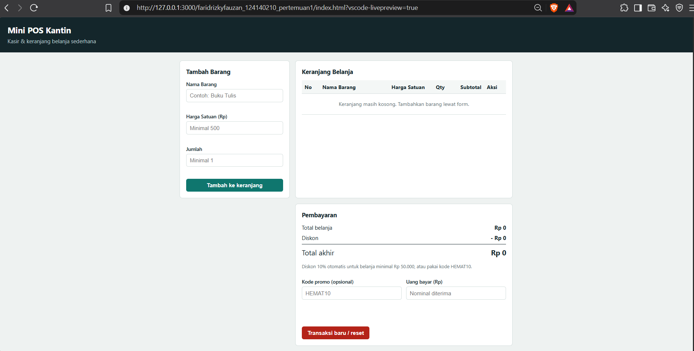
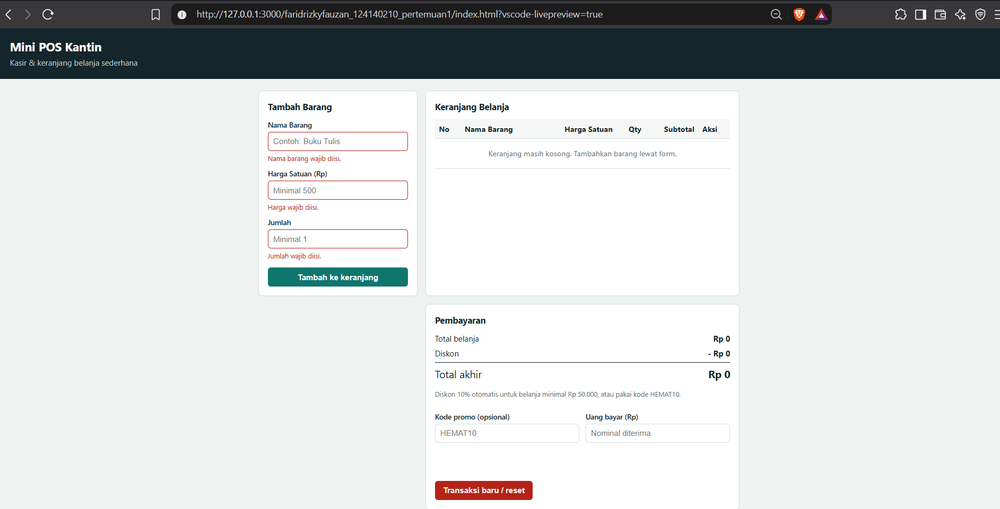
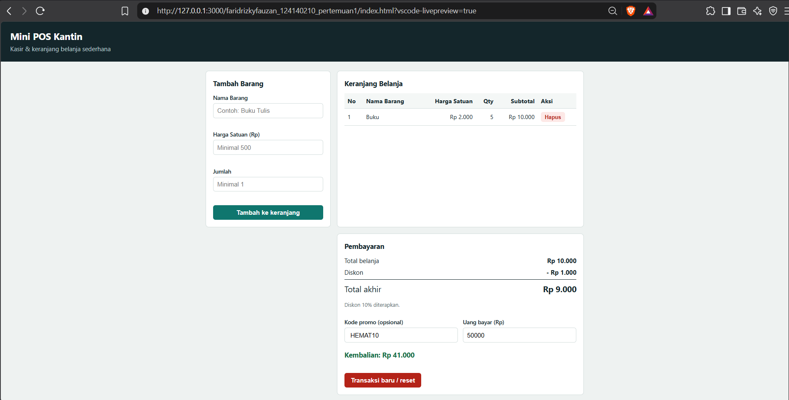

# pemrograman_web_itera_124140210

Repository praktikum Pemrograman Web ITERA.

## Identitas
- **Nama Lengkap**: Farid Rizky Fauzan
- **NIM**: 124140210
- **Kelas Praktikum**: RA

## Daftar Pertemuan
| Pertemuan | Folder | Isi |
|---|---|---|
| 1 | [faridrizkyfauzan_124140210_pertemuan1](faridrizkyfauzan_124140210_pertemuan1) | Tugas Mini POS + folder `modul/` (praktikum & latihan JavaScript Dasar) |

---

# Pertemuan 1 - Mini POS: Kasir & Keranjang Belanja Sederhana

## Deskripsi Aplikasi
Mini POS adalah aplikasi web kasir sederhana untuk kantin/toko kampus. Kasir memasukkan barang (nama, harga, qty), aplikasi menghitung subtotal, total, diskon, dan kembalian secara otomatis. Isi keranjang disimpan di `localStorage` sehingga tidak hilang saat halaman di-refresh. Aplikasi ini menyatukan tiga kompetensi praktikum: validasi form, kalkulator otomatis, dan manajemen keranjang berbasis localStorage.

Studi kasus yang dipilih adalah transaksi kasir di kantin/toko kampus. Tabel keranjang berfungsi sebagai riwayat data barang yang dibeli, dan kalkulator uang bayar/kembalian sebagai kalkulator keuangannya.

## Panduan Menjalankan
1. Clone repository ini, lalu buka foldernya di VS Code.
2. Install ekstensi **Live Server**.
3. Masuk ke folder `faridrizkyfauzan_124140210_pertemuan1`, klik kanan `index.html` → **Open with Live Server** (atau cukup double-click `index.html`, tanpa build/install apa pun).
4. Folder `modul/` berisi latihan praktikum; buka `index.html` di tiap subfolder dengan cara yang sama (butuh internet untuk Tailwind CDN dan Fetch API).

## Daftar Fitur
- [x] Validasi nama barang (wajib, min 3 karakter)
- [x] Validasi harga satuan (angka, min Rp 500)
- [x] Validasi qty (bilangan bulat, min 1)
- [x] Pesan error merah di bawah input; barang tidak masuk keranjang jika tidak valid
- [x] Form otomatis di-reset setelah berhasil
- [x] Subtotal per baris (harga × qty) dan total belanja otomatis
- [x] Diskon 10% untuk belanja ≥ Rp 50.000 atau kode promo `HEMAT10`
- [x] Kalkulator uang bayar dan kembalian, dengan pesan jika uang kurang
- [x] Tabel keranjang (No, Nama, Harga, Qty, Subtotal, Aksi) dengan tombol Hapus
- [x] Persistensi `localStorage` (`JSON.stringify` / `JSON.parse`)
- [x] Tombol Transaksi Baru / Reset
- [x] Format Rupiah dan tampilan responsif

## Tangkapan Layar
| Form input utama | Validasi error | Hasil perhitungan & tabel |
|---|---|---|
|  |  |  |

## Penjelasan Teknis Singkat
- **Validasi input**: `validasiForm()` memeriksa tiga field dan mengembalikan objek pesan error. `tampilkanError()` menulis pesan merah di bawah input. Jika ada error, fungsi `submit` berhenti (`return`) sehingga barang tidak ditambahkan.
- **Algoritma kalkulator**: `hitungTotal()` menjumlahkan `harga × qty` dengan `reduce()`. `hitungDiskon()` memberi 10% jika total ≥ 50.000 atau kode `HEMAT10` valid (tidak ditumpuk). Total akhir = total − diskon; kembalian = uang bayar − total akhir. Semua dihitung ulang oleh `renderSemua()` setiap keranjang atau input berubah.
- **Serialisasi localStorage**: setiap perubahan keranjang memanggil `simpanKeranjang()` (`JSON.stringify` ke key `mini_pos_keranjang`). Saat halaman dibuka, `muatKeranjang()` memakai `JSON.parse` dalam `try/catch` agar data rusak tidak membuat aplikasi error. Tombol reset memanggil `localStorage.removeItem`.

## Struktur Folder
```
pemrograman_web_itera_124140210/
├── README.md
└── faridrizkyfauzan_124140210_pertemuan1/
    ├── index.html
    ├── style.css
    ├── script.js
    ├── README.md
    ├── screenshots/
    └── modul/
        ├── 01_variabel_kondisional/   (praktikum.js + latihan.js)
        ├── 02_loop_fungsi/
        ├── 03_array_objek/
        └── 04_dom_api/
```
